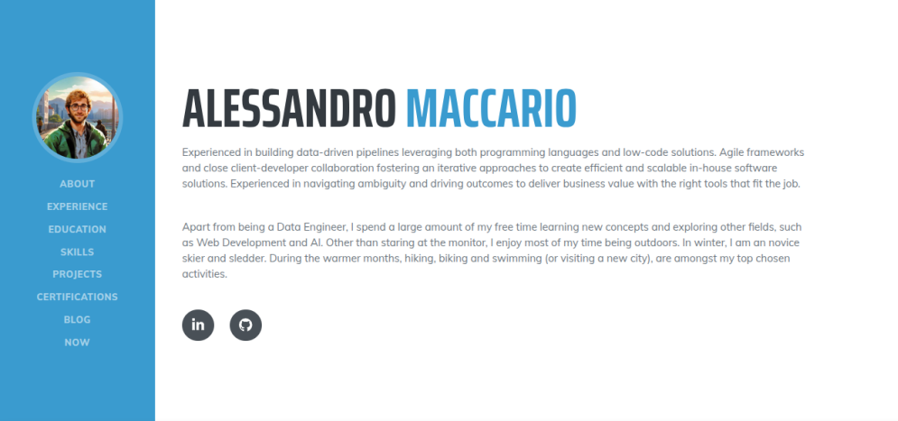
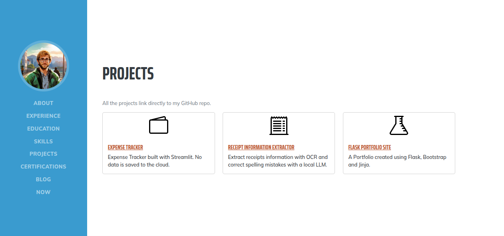
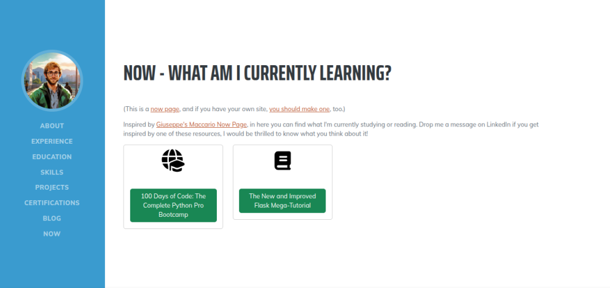

# Day 83: Professional Portfolio Project

# Personal Portfolio (Flask + Bootstrap)

A professional portfolio web site built using Flask, Bootstrap, and Jinja2.

# Overview

This is a simple but polished personal portfolio using a template from [Start Bootstrap](https://startbootstrap.com/). It’s based on the [Resume](https://startbootstrap.com/theme/resume) theme.
The site features a left-hand navigation bar with a profile photo, and multiple content sections (projects, books or courses completed, etc.).
It’s fully responsive — optimized for smartphones, tablets and desktop screens.

# Built With

- Flask - lightweight Python web framework
- Bootstrap - for styling and responsive layout
- Jinja2 templating engine (bundled with Flask) for HTML templates
- A JSON-based data backend: the portfolio data (projects, books, courses) is stored in simple JSON files, keeping the architecture straightforward

# Getting Started
### Prerequisites

- Python 3.12
- Flask
- uv

# Usage

The left navigation bar allows visitors to jump between sections (e.g., About, Projects, Books & Courses, Contact).
The portfolio content (projects, books, courses) is defined in JSON files so you can easily update or expand it without touching the code.
The site adapts its layout depending on screen size — on mobile devices it collapses the nav bar into a toggleable menu.

# How does it look like?
- 
- 
- 